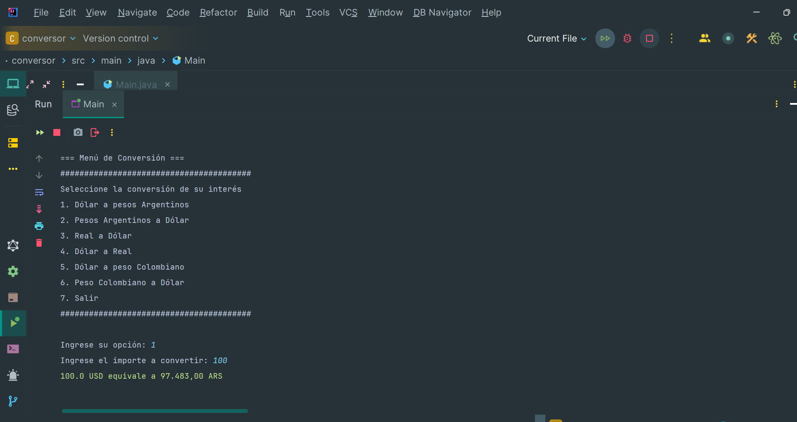
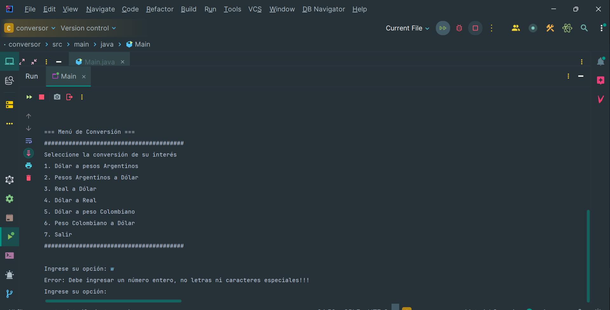
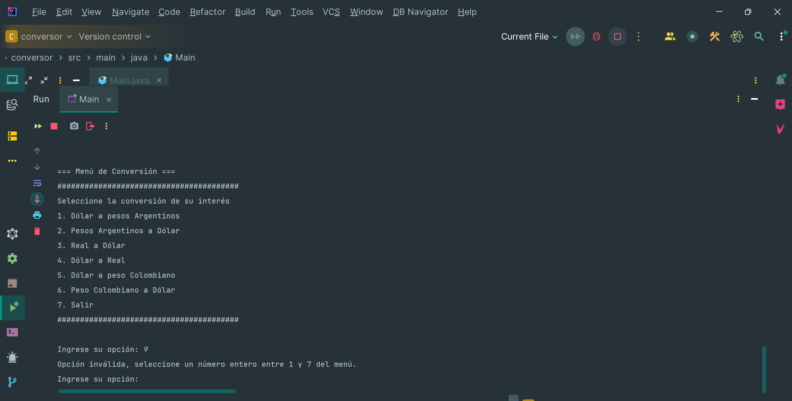
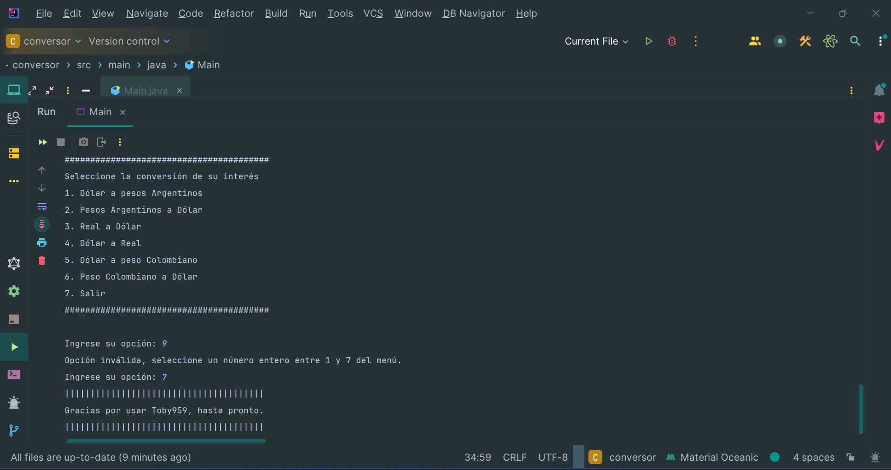
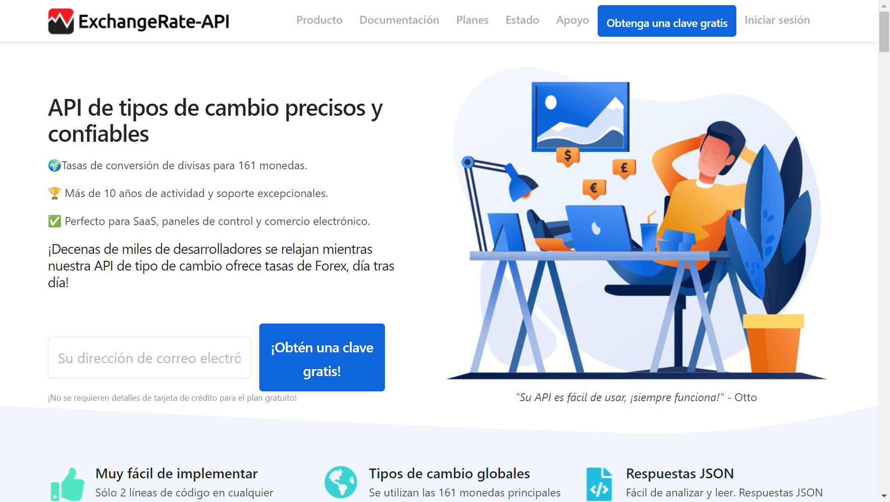

 <h1 aling="center"> Conversor de Monedas 🏦 </h1>

___


&nbsp;&nbsp;&nbsp;&nbsp;&nbsp;&nbsp;&nbsp;&nbsp;&nbsp;[](LICENSE)&nbsp;&nbsp;&nbsp;[](https://GitHub.com/toby959/conversor-toby959/watchers/)
___
# Descripcion 📖
Este proyecto es un conversor de monedas que permite realizar diversas conversiones entre diferentes tipos de monedas, incluyendo Dólar, Pesos Argentinos, Reales y Pesos Colombianos. Utiliza la **Exchange Rate API** para obtener las tasas de cambio en tiempo real. Puedes encontrar más información sobre esta API en su [web](https://www.exchangerate-api.com/)
___
# Recursos:

| Plugin          | URL                      |
|-----------------|--------------------------|
| Gson            | https://mvnrepository.com/artifact/com.google.code.gson |
| Dotenv          | https://mvnrepository.com/artifact/io.github.cdimascio/dotenv-java| 


# Herramientas utilizadas 🛠️
___
* 1 - IntelliJ IDEA Community Edition.
* 2 - Java version 17.0.10.
* 3 - dotenv-java(es una biblioteca de Java que permite cargar variables de entorno desde un archivo .env en tu proyecto).
* 4 - Scanner(es una herramienta fundamental en Java para el ingreso de datos por consola, lo que permite interactuar con el usuario de manera efectiva).
* 5 - Google.code.gson version 2.11.0
* 6 - DecimalFormat(En tu código, la instancia df se configura con el patrón "#,###.00", lo que significa que los números se mostrarán con un separador de miles y dos decimales).
* 7 - ANSI Escape Codes (permite cambiar el color del texto en la consola).
___
# Ejecutar el Proyecto ⚙️
1 - Clona el repositorio en tu maquina local
``` bash
git clone
<https://github.com/toby959/conversor.git>
```
2 - Abre tu IDE, debes tener en cuenta, que los ANSI Escape Codes son secuencias de control que no se clasifican como métodos o funciones, sino como instrucciones que los terminales interpretan para modificar la presentación del texto y puede que en tu IDE, no funcione.  
3 - Compila y ejecuta el archivo Main.java.
___
# Funcionalidades 📦
* Conversión de Monedas: Permite convertir entre diferentes tipos de monedas.
* Interfaz de Usuario: Ofrece una interfaz simple y amigable basada en la consola.
* Tasas de Cambio Actualizadas: Utiliza una API para obtener tasas de cambio en tiempo real.
___
# Colaboraciones 🎯
Si deseas contribuir a este proyecto, por favor sigue estos pasos:

1 - Haz un fork del repositorio: Crea una copia del repositorio en tu cuenta de GitHub.  
2 - Crea una nueva rama: Utiliza el siguiente comando para crear y cambiar a una nueva rama:
```bash
git chechout -b feature-nueva
```
3 - Realiza tus cambios: Implementa las mejoras o funcionalidades que deseas agregar.  
4 - Haz un commit de tus cambios: Guarda tus cambios con un mensaje descriptivo:
```bash 
git commit -m 'Añadir nueva funcionalidad'
```
5 - Envía tus cambios: Sube tu rama al repositorio remoto:
````bash
git push origin feature-nueva
````
6 - Abre un pull request: Dirígete a la página del repositorio original y crea un pull request para que revisemos tus cambios.

Gracias por tu interés en contribuir a este proyecto. ¡Esperamos tus aportes!
___
## Imagenes 📸










#### Ten en cuenta que la clave gratuita, tiene una duración de 14 días, luego expira.

.png)

## Licencia 📜

Este proyecto está licenciado bajo la Licencia MIT - ver el archivo [LICENSE](https://github.com/toby959/conversor/blob/main/LICENSE) para más detalles.
